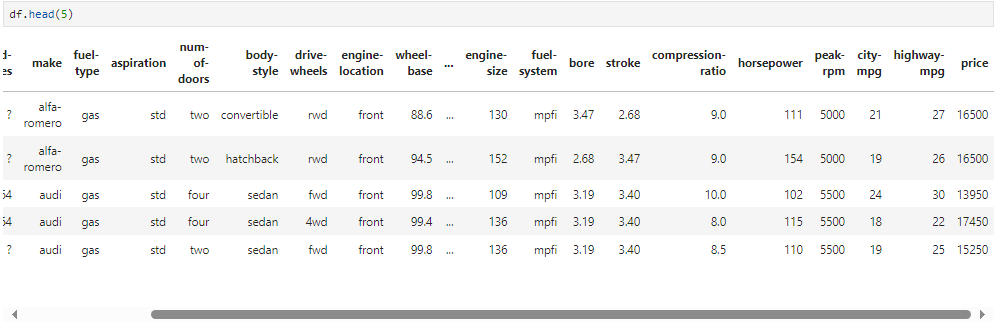
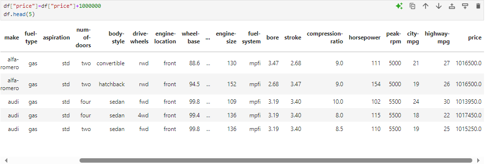

# 🌌 Chapter 1: Pre-processing Data in Python
---
This module focuses on data preprocessing. It is the process of converting data from one raw form into another format, in order to prepare the data for further analysis after importing. Thus, it is an important step. It is also called as Data Cleaning or Data Wrangling.  
The learning objectives are:
- Identifying and handling the missing values, i.e empty entries.
- Data Formatting: Converting the data of different formats or units into the standardized one using Pandas.
- Data normalization: Bringing all the data in the similar range for meaningful comparison (using centering / scaling).
- Data Binning: Creating bigger categories for a set of numerical values. Useful to compare the groups of data.
- Will see about categorial variables and converting them to numerical values. Useful to make statistical modelling easier.

### Basics of Data Formatting:  
In Python, we perform operations on a datarame along the columns. Each row of the dataframe represents a sample, i.e. the different "used car" in the database. To access a column, specify its name in the indexing.  
Eg: Using `df["symboling"]`, we can access the column as  

Each column is a Panda series. There are many such ways to manipulate dataframes in Python. For eg. one can add an entry to each value of the column. It's done using the command:  
`df["price"]=df["price"]+1000000`

---