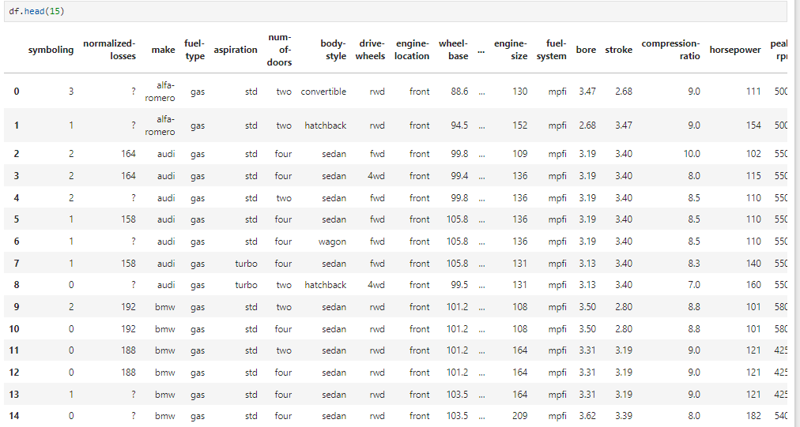
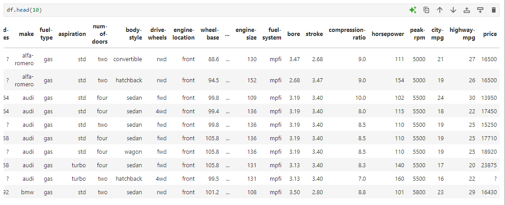
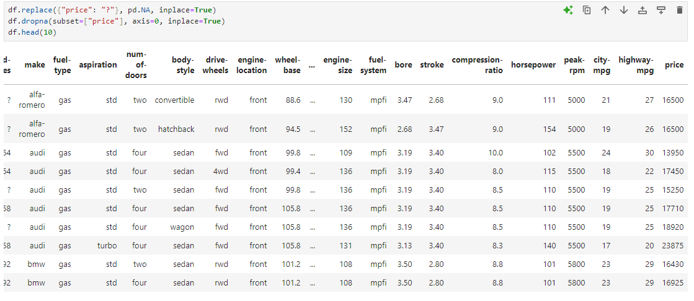
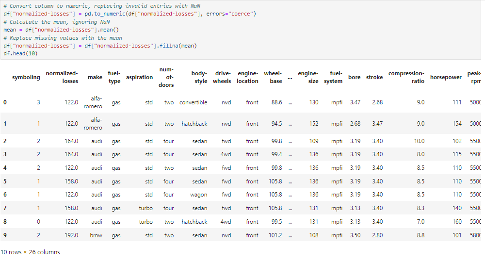

# 🌟 Chapter 2: Dealing with Missing Values in Python

The missing values occur when no value is stored for a variable in the observation. In the displayed dataframe, they appear as "?", "N/A", 0 or just a blank cell. In the below representation it appears as "?".  
  

### How to deal with missing data?
 **Check with the data collection source if the missing data value is available**

 **Drop/ Remove the data containing missing values:**
 - drop the variable or just  
 - drop the data entry  

 **Replacing the data** (better option): But it can be less accurate as we have to guess for the value at the entry. Thus techniques can be:
 - Replace it with an average of entire variable (i.e. column). 
Eg. Like if the average of the values in Normalizes losses is 170, we can replace them with 170.  
 - Replace it based on frequency  
But what if the values can't be averaged, like with the categorical variables like fuel-type, that doesn't have a numerical data. In such case, we can use the "mode" of the data variable, i.e the most common of the fuel-type across the column, eg gasoline.  
 - Replace it based on other functions:  
 Analysing the other data variables, we can just assign the general possible value for the missing variable.  

 **Leave it as the missing data**  
Sometimes, leaving the missing data as it is benificial for certain operations or may not be a major issue.  

### Dropping a missing value  
This is done using the `dropna()` function. Using it, we can drop an entire row or column consisting of missing value of the desired data variable. For eg., since we're going to analyze the price model in the upcoming course, let's delete the row that has missing value for the data variable `price`. For deleting all the rows or columns with missing values, we have to specify the axis number.  
For rows, `axis=0`.  
For columns, `axis=1`.  
Thus to delete all the rows in a dataframe with missing values, we perform:  
`df.dropna(subset=["price"], axis=0, inplace=True)`  

If one just wants to return a dataframe with no missing values without altering the originial dataframe altogether (i.e. just returning a copy of modified df), we can avoid the `inplace=True` attribute.  

In some cases, If the placeholder is "`?`" instead of "`NaN`", like in my case, we cannot use the `dropna()` function thus we first need to run the following command.  
`df.replace({"price": "?"}, pd.NA, inplace=True)`  
  
  

### Replacing the missing value
Instead of just dropping the data variables with missing values, filling the elements with missing value with an average value of the certain data vaiable is both convenient and harmless in most cases. To replace the values we use the following syntax for the `replace()` function:  
`dataframe.replace(missing_value,new_value)`  
Let's replace the missing values in normalised losses with mean. For that, we need to first assign the mean to a variable `mean`. But before that check with df.dtypes that `normalized-losses`, even though numeric, is denoted as an object. First, by converting it to a numeric data,we find the mean and we replace the missing values by mean as as:
```md  
df["normalized-losses"] = df["normalized-losses"].replace(pd.NA, mean)
df["normalized-losses"] = df["normalized-losses"].replace(pd.NA, mean)
```  

For some reason, if the above function doesn't work properly, a more specific function to handle the missing values called the `fillna()` is used.  
`df["normalized-losses"] = df["normalized-losses"].fillna(mean)`

