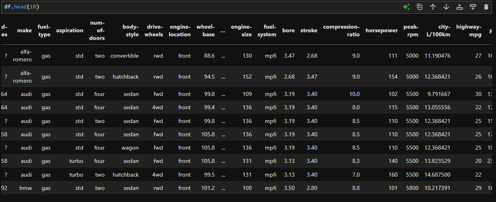

# 🌟 Chapter 3: Data Formatting in Python
More often, we want our data to be formatted so that its units or scale matches to that of other data variables to make the data more readable.Data formatting is bringing data into a common standard of expression allowing the users to make meaningful comparison.  
For eg. the New York residents, when asked to give their address, may write NY, Ny, N.Y., New York, etc. Here, all of the above entries are true, but to make the calculation easier so that we show all these entries mean the same thing, we have to standardize them into one single entity. Specifically "New York" will create the least confusion.  

## Aplying calculations to an entire column  
Suppose in our imported data set, instead of the given data variable `mpg` (miles per gallon), users are more familiar with `L/100km` i.e. litres per 100 km. To convert all the data entries in the later unit, we simply conduct the following operation as:  

`df["city-mpg"]=235/df["city-mpg"]`
And to show that the data is now `L/100km` we also rename the column name as:  
`df.rename(columns={"city-mpg":})`  

 

## Incorrect data types  
Sometimes, the wrong data type is assigned to an entity. Eg:  
  
Here, we need to recorrect the data type to a numeric value, specifically float. Otherwise, the developed models later on may behave strangely and the valid data may be treated as a missing data. For this we use the `astype()` function as, eg:  

`df["price"] = df["price"].astype("float")`  
However, the `astype()` function cannot handle the invalid values (like `NaN`). So use it when you're sure all the values are valid. Else you can just use the general and efficient function `to-numeric` because it has the `errors="coerce"` attribute to handle invalid values:  
`df["price"] = pd.to_numeric(df["price"], errors="coerce")`
  
See, now the data type is correctly assigned.