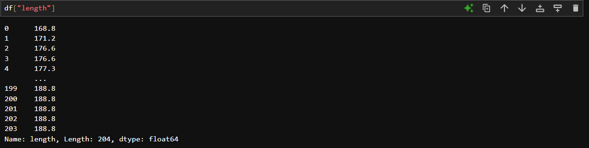
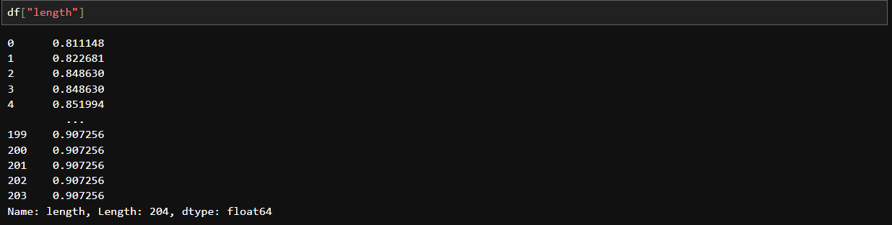
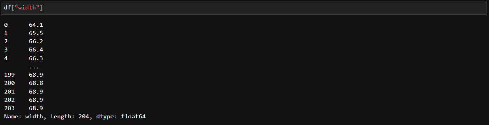
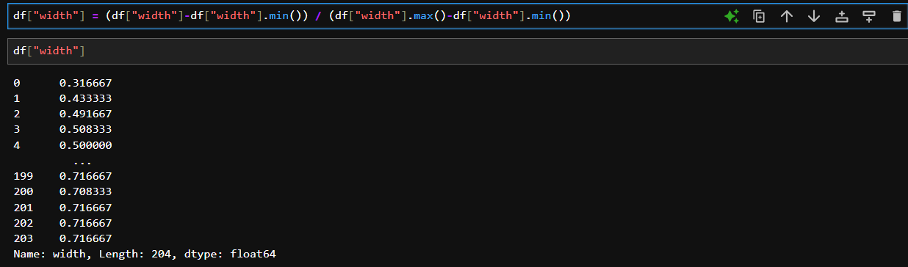
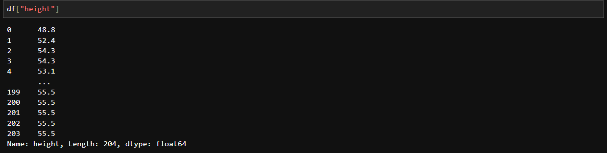
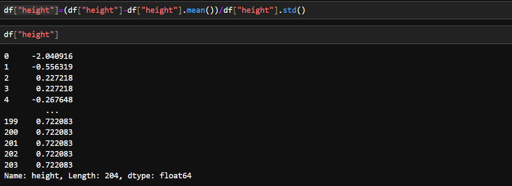

# 🌟 Chapter 4: Data Normalization in Python
Normalization of data is the process of scaling the values of numeric data in a dataset to a specific range or distribution. It is often used to ensure that the data fits within a specific scale, which can improve the performance and stability of machine learning models and algorithms. For eg:  
In the given range, the length varies from 150-250 but width varies from 50-100. To bring them in the common range is an imporatant part of data preprocessing to make some statistical analysis easier. For eg:  
| Age | Income   |
|-----|----------|
| 20  | 100000   |
| 30  | 20000    |
| 40  | 500000   |

Here, age ranges from 0-100, while income ranges from 0-20000 and higher. Income is about 1000 times larger than age. Thus in the further analysis, during _linear regression_ the attribute income will intrinsically influence the result more, but this doesn't necessarily mean that the attribute age is any less important. To avoid the more influence of income over age we can normalize the values of income and age range. This makes sure that both attributes will have the similar impacts in the models we build later.  
| Age  | Income|
|------|-------|
| 0.2  |  0.2  |
| 0.3  |  0.04 |
| 0.4  |   1   |

## Methods of normalizing the data:  
There are many ways to normalize the data. Following are the few ways to do so:-  

### 1] Simple feture scaling:
 xnew=xold / xmax. Thus the older data values will be divided by the max values in the data attributes. The resulting new value ranges from 0 to 1.  

### 2] Min-Max:
 xnew=xold - xmin / xmax - xmin Thus, we subtract the min value of the data from the data value and then divide the difference by the data range. The resulting new value ranges from 0 to 1.  

### 3] Z- score:
 xnew=xold - _μ_ / _σ_, where μ is the average of the data and σ is the standard deviation. The resulting value hower around zero and typically range between -3 to +3, however may go a bit lesser or higher.  

## Simple feature scaling using Python:

With Pandas:  
1) Before  
  
2) After using the Pandas `max()` function: `df["length"] = df["length"] / df["length"].max()`  

## Min-max in Python:

With Pandas:  
1) Before  
  
2) After using the Pandas `min()` and `max()` functions: `df["width"] = (df["width"]-df["width"].min()) / (df["width"].max()-df["width"].min())`  

## Z-score in Python:

With Pandas:  
1) Before  

2) After using the Pandas' `mean()` and `std()` functions: `df["height"]=( df["height"]-df["height"].mean() ) / df["height"].std()`  
