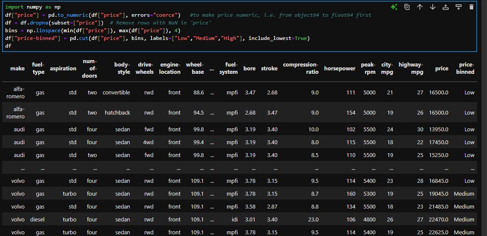
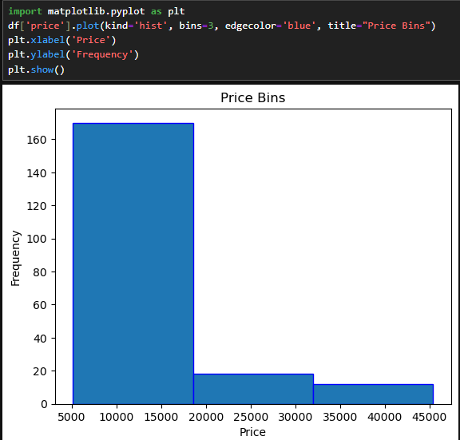

# 🌟 Chapter 5: Binning in Python
Binning is the concept of categorizing a data set into a few desired groups. This can be easily done with Numpy and Pandas as following:  
```python
bins = np.linspace(min(df["price"]), max(df["price"]), 4)
df["price-binned"] = pd.cut(df["price"], bins, labels=["Low","Medium","High"], include_lowest=True)
```  
Thus, the binned data appears as:

This can also be shown using a histogram as:  
