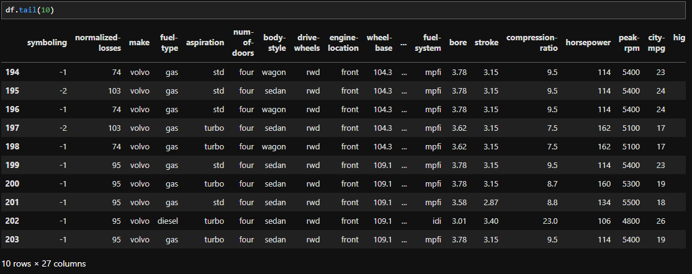
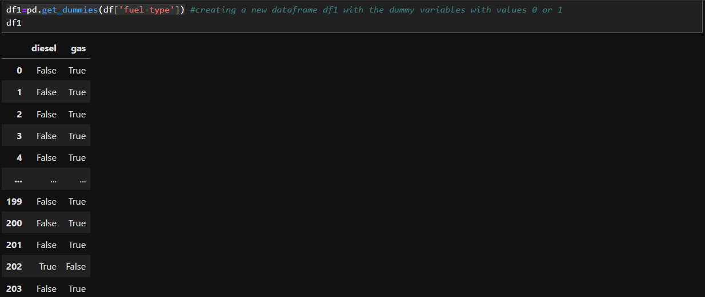
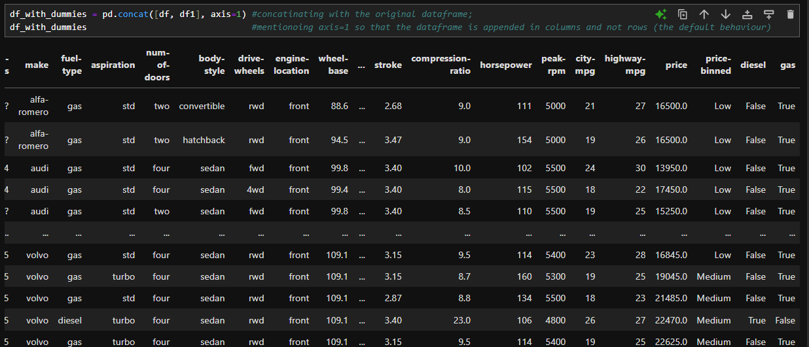

# 🌟 Chapter 6: Turning Categorical variables into Quantitative variables

While training models, the object64 or string data types do not exactly contribute to the statistical value of the variable. Like we have a few varied normalized entries in the dataframe column, obviously they come in certain frequencies. These frequencies offer the meaning to them. To compare them in seperately, we create a new dataframe with the dummy variable as attributes. These dummy variables are actually each unique different entries in the column. To create this dataframe we use the `get_dummies()` function in the Pandas.  
Observe that these variables are `gas` and `diesel` in the data column `fuel-type`.  
  
We can create the dummies' dataframe as:  
`df1=pd.get_dummies(df['fuel-type'])`  
  
To add this new dataframe into the original dataframe, we can do so with the Pandas' `concat()` function.  
