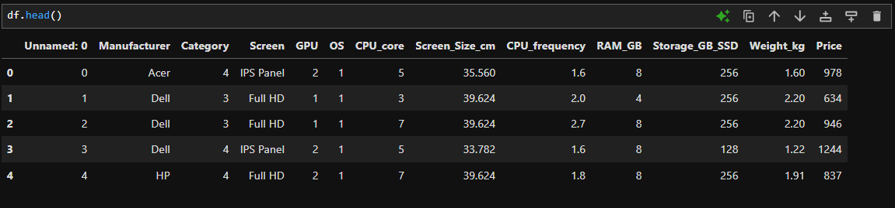
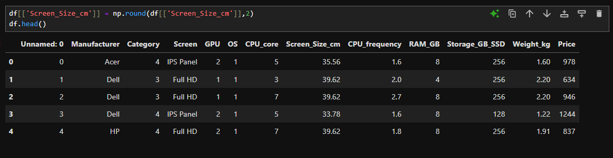

Some additional methods:  
Consider using the Jupyterlite service instead of the Jupyter Notebook (Anaconda distribution). Here, for importing a dataset in csv format to the data frame is not as straight forward as:  
```python
import pandas as pd  
df=pd.read_csv("filepath", header=)
```   
Below are the steps:  
```python
import pandas as pd  
from pyodide.http import pyfetch

async def download(url, filename):
    response = await pyfetch(url)
    if response.status == 200:
        with open(filename, "wb") as f:
            f.write(await response.bytes())  

file_path= "https://cf-courses-data.s3.us.cloud-object-storage.appdomain.cloud/IBMDeveloperSkillsNetwork-DA0101EN-Coursera/laptop_pricing_dataset_mod1.csv"  
await download(file_path, "laptops.csv")  
file_name="laptops.csv"  
df = pd.read_csv(file_name, header=0)  
```  
Else, normally in the Jupyter Notebook, we perform:  
```python
filepath = "https://cf-courses-data.s3.us.cloud-object-storage.appdomain.cloud/IBMDeveloperSkillsNetwork-DA0101EN-Coursera/laptop_pricing_dataset_mod1.csv"
df = pd.read_csv(filepath, header=None)
```
<hr>
Now, let's move to the data wrangling part.  

## Rounding off function:
Below is the dataframe of the dataset:  
  
To round of the `Screen_Size_cm` column, we can use the `numpy.round()` function.  
  
