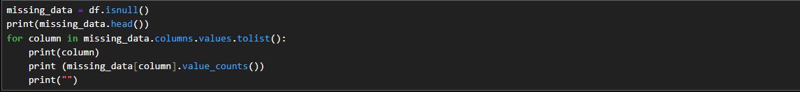
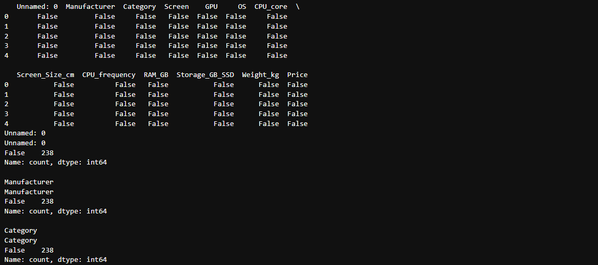
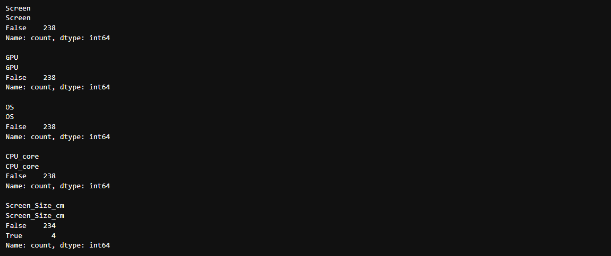
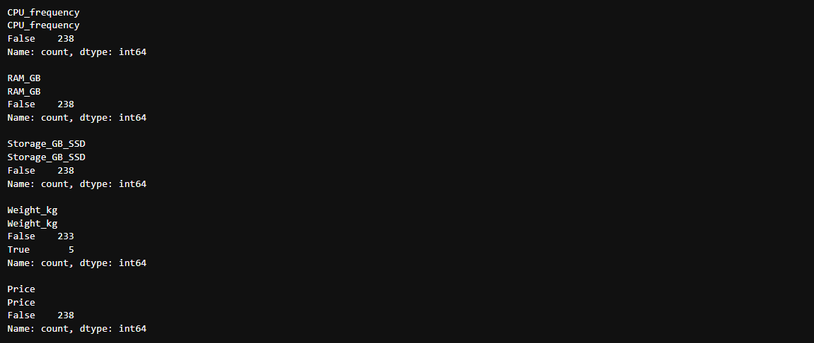
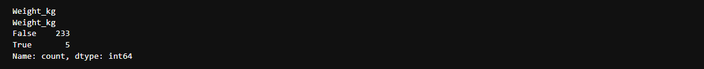
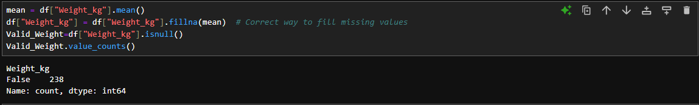
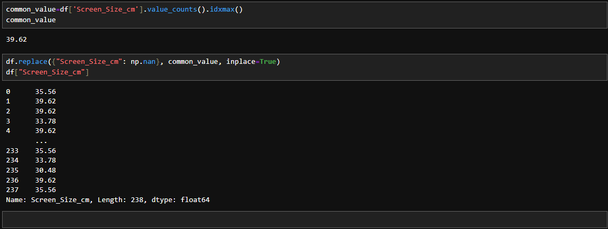

# Revision Practice 
## Some additional methods:  
Consider using the Jupyterlite service instead of the Jupyter Notebook (Anaconda distribution). Here, for importing a dataset in csv format to the data frame is not as straight forward as:  
```python
import numpy as np
import pandas as pd
import matplotlib.pyplot as plt
%matplotlib inline
pip install pyodide-py
```   
Below are the steps:  
```python
import requests

def download(url, filename):
    response = requests.get(url)
    if response.status_code == 200:
        with open(filename, "wb") as f:
            f.write(response.content)

file_path= "https://cf-courses-data.s3.us.cloud-object-storage.appdomain.cloud/IBMDeveloperSkillsNetwork-DA0101EN-Coursera/laptop_pricing_dataset_mod1.csv"
file_name = "laptops.csv"

# Download the file
download(file_path, file_name)
```  
Else, normally in the Jupyter Notebook, we perform:  
```python
filepath = "https://cf-courses-data.s3.us.cloud-object-storage.appdomain.cloud/IBMDeveloperSkillsNetwork-DA0101EN-Coursera/laptop_pricing_dataset_mod1.csv"
df = pd.read_csv(filepath)
```
<hr>
Now, let's move to the data wrangling part.  

## Rounding off function:
Below is the dataframe of the dataset:  
  
To round of the `Screen_Size_cm` column, we can use the `numpy.round()` function.  
  

## Missing Values' Columns:  
To give out the missing values column, we have the following code:  
```python
missing_data = df.isnull()
print(missing_data.head())
for column in missing_data.columns.values.tolist():
    print(column)
    print (missing_data[column].value_counts())
    print("")
```  
Here, we used the `dataframe.isnull()` function which returns the dataframe where missing values are returned as `True` and finite values are returned as `False`. We store this dataframe as the `missing_data` dataframe.  
After that, we printed it. Then, running a for loop using the `.values.tolist()` function on the values of columns of dataframes to use the values of the dataframe `missing_data`, we print the column name followed by the dataframe's unique values' counts.  
  
  
  
  

## Replacing the empty values with Average data: 
As discussed earlier, the best practice is to replace the empty values to the column mean if desired. While there are many approaches to do so, the generalised simpler approach is to use the `fillna()` method instead of the common `replace()` method specifically while dealing with the empty values.  
```python
mean = df["Weight_kg"].mean()   #First find the mean
df["Weight_kg"] = df["Weight_kg"].fillna(mean)  # Simple way to fill missing values
```  
Earlier we saw this:  

After removing the empty values, we see this:  
```Weight_kg
False    238
Name: count, dtype: int64
```  
  

## Replacing the empty values with Most common data:  
For the categorical data with fix values, replacing with average value may be wrong as the average value itself may not be an existing category. Thus we use the most occuring data to replace in place. Now, here we use the `idxmax()` function on the `value_counts()` method. The `value_counts()` method counts the occurrences of unique values in a column, and `idxmax()` finds the most frequently occurring value (mode of the data).  
  
