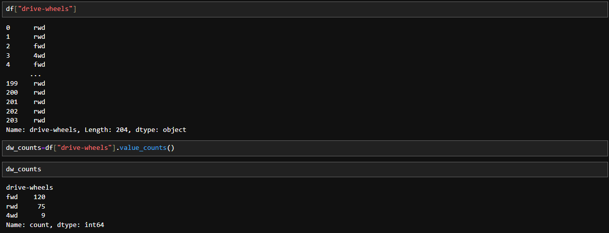
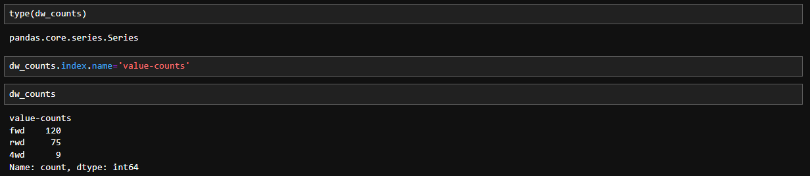
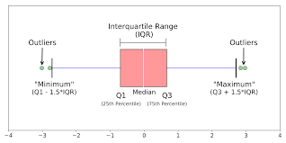
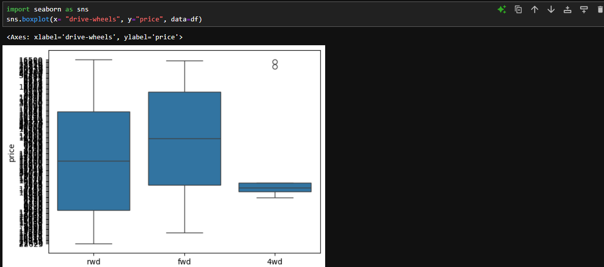
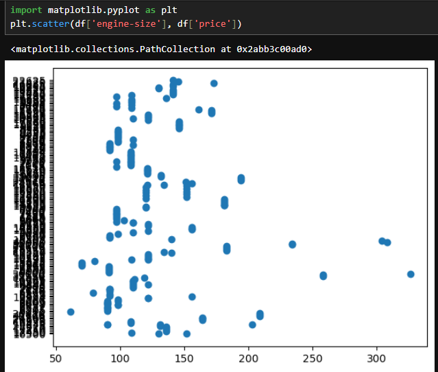
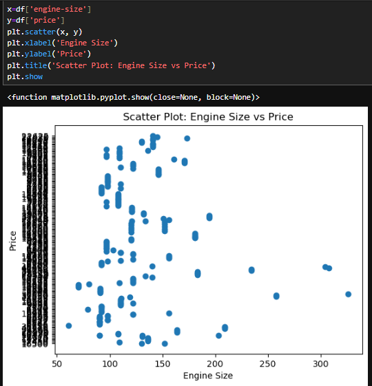

# 🌌 Descriptive Statistics

While beginning to analyse the data, before spending your time building complicated models, it's important to first `explore` the data.  
One way to do so is to calculate some descriptive statistics of your data. The Descriptive Statistics helps to understant the basic features of a dataset and obtain a short summary about the sample and the measures of the data.  
## Methods for Descriptive Statistics:
## Using the describe() function:
Using the `describe()` function in Pandas and applying on the dataframe offers basic statistics of all numerical variables. It shows the mean, total number of data points, standard deviations  

## Using the value_counts() function:
It gives the `Pandas Series` of information on the counts of the categorical data values of a data set. Consider the data: `drive-wheels`.

Note that it is a series. Thus, we rename the column name with the `index.name` method as:  

## Using Box Plots:
These are the great ways to visualize the numeric data. Following are the main features of the box plots:  

- Median: Shows >where the middle of the data point is.
- Upper Quartile: Shows where the 75th percentile is.
- Lower Quartile: Shows where the 25th quartile is.
- Inter-Quartile Range (IQR): The data between the upper and the lower quartile
- Lower and Upper Extremes: Calculated as 1.5 times below and above the IQR.
- Outlier/ Single data points: These are the individually occuring single dots that appear outside the box plots.  
Thus, box-plots make it easier to spot outliers and understand the data distribution and its skewness. Primarily, they make it easier to compare between the groups. They show distribution of different categories of `drive-wheel` group over the `price` feature. 

Here, the distribution of 4 wheel drive is distinct from the rest while that of front wheel drive and rear wheel drive are almost of the same size.

## Using Scatter Plots:
Numerical data variables that have real values in a certain range are called continous variables. For eg., in our dataset, the `price` variable and the `Engine-size` variable are the coninous values. There can be a possible a relational pattern between them. If there is, engine size can predict the price, right? One good way to visualize this is using scatter plots. Each data value or observation in a scatter plot is represented as a point or dot. The plot shows the relation between two variables: The `predictor` variable and the `target` variable. The `predictor` variable is used to predict the outcome. Thus, we typically set it on the x-axis. In this case, we'll thus set engine size on the x-axis. Similarly, the `target` variable is the one you are going to predict. Thus, it's the outcome. Hence we set it on the y-axis (as f(x)).  
We're using the Matplotlib `scatter()` function here, taking in `x` and `y` variables.  
  
Here, we label the axes to get the clear understanding in the picture itself.  
  
We see that as the engine size goes up, the price of the car also goes up instantly.