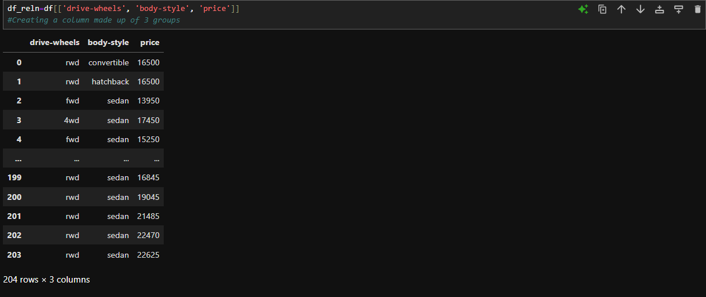

# 🌌 GroupBy in Python

The groupby method in Python is somewhat similar to binning, but is more significant in the analytical level. Here the basic question we try to answer is:
- **Is there any `relationship` between the different types of a data / datas and an other value.**

For this, we use the Pandas' `groupby()` method. This is specifically applied for categorical variables. Here, we group the categories with the categorical variables in a group or multiple groups (columns) by passing multiple variable names. 

Eg: Grouping drive wheel type, body style type and price groups.  
- Step1: Joining the columns together.  
`df_reln=df[['drive-wheels', 'body-style', 'price']]`  
  

- Step2: Groupby method: Making unique combinations of groups and equating the remaing parameters (price here), to the average in each unique groups.  
`df_grp = df_reln.groupby(['drive-wheels', 'body-style'], as_index=False).mean(numeric_only=True)`  
  
Compare how there were 203 rows in the previous picture and in total only 12 unique pairs in this grouped columns.  

- Step3: Pivotting the data:  
To "pivot" the data, i.e. to make it more structured and readable, we can use the Pandas `pivot()` function.  
`df_pivot=df_grp.pivot(index="drive-wheels", columns="body-style", values="price")`  
  

- Step4: Heatmaps:  
Another way to represent the pivot table is using a heat map plot. It is a great way to plot the target variable over multiple variables, and through this, we get visual clues of the relationship between these variables and the target.  
 
```python
import matplotlib.pyplot as plt
plt.pcolor(df_pivot, cmap="RdBu")
plt.colorbar()
plt.show()
```

In this example, we use Pyplot's pcolor method to plot heat map and convert the previous pivot table into a graphical form. We specified the red-blue color scheme.  
