# 📊 Data Visualization in Python 📉 📈

Like the normal data analysis tools Numpy and Pandas, data visualization is done using the external libraries in Python. Primarily, we here focus on `Matplotlib` and `Seaborn`. Data Visualization is an outstanding way to summarize the analysed data in simpler and engaging way. Let's see how to use them step by step:  

## Importing the libraries:  
#### 1] Matplotlib:
For this, we use the following command in general:  
`import matplotlib.pyplot as plt`  
Alternatively, we can use:  
`from matplotlib import pyplot as plt`  
Both the commands mean the same thing that we are importing the functionalities from the pyplot class in the library matplotlib. In the Jupyter Notebook, for having the output graph inside the notebook interface itself, we add the following "magic" statement:  
`%matplotlib inline`.

#### 2] Seaborn:
The command is:  
`import seaborn as sns`.  

## Matplotlib Functions:
### 1] Standard Line Plot:  
Here the x and y parameters with respect to the axes are passed. The y variable is the dependent parameter and x is the independent one. Here a line straight line is plotted directly joining the points corresponding to the (x, y) value pairs. Syntax:  
`plt.plot(x,y)`
Eg 1:  

```python
x=8
y=9
plt.plot(x,y, marker='o')
plt.show
```  
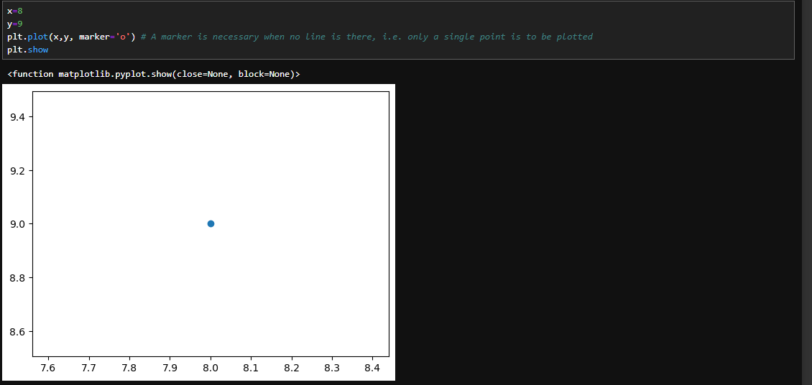  

Eg 2:  
```md
import matplotlib.pyplot as plt
X = [1,2,3,4,5,6,7,8,9]
Y = [3,6,2,7,11,12,13,16,12]

plt.plot(X, Y, marker='o')  # 'o' draws markers on each point
plt.show()
```  
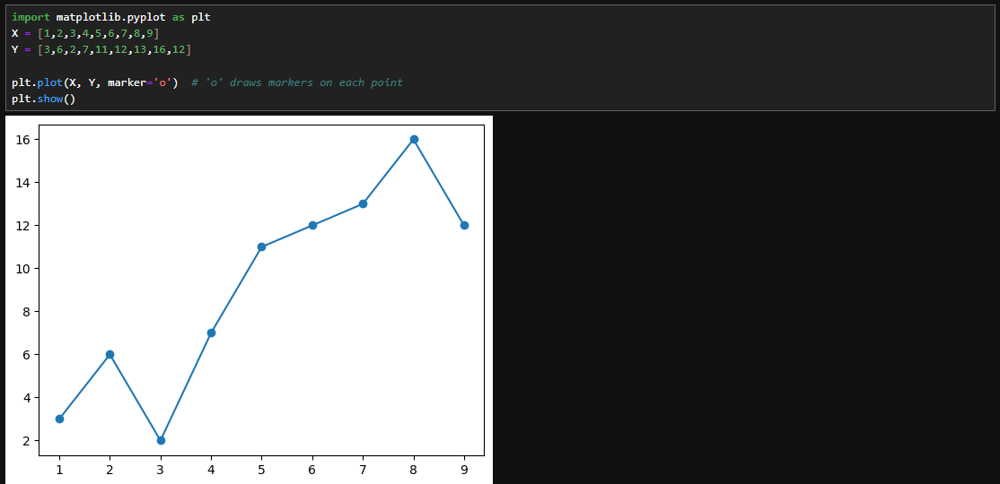  

### 2] Scatter Plots:
Scatter plots are used in either of the following situations:
- When we have paired numerical data.  
- When there are multiple values of the dependent variable for a unique value of an independent variable.  
- In determining the relationship between variables in some scenarios  
Here, x contains the independent variable, and y contains the dependent variable. You have the option to change the size, color, and shape of the markers with additional attributes in the function.  
Eg:  
```python
df['horsepower']=pd.to_numeric(df['horsepower'], errors='coerce')  # To make the variable a numeric value
df.plot.scatter(x='horsepower', y='price', c='blue', alpha=0.5)
plt.title("Horsepower vs. Price")
plt.show()
```  
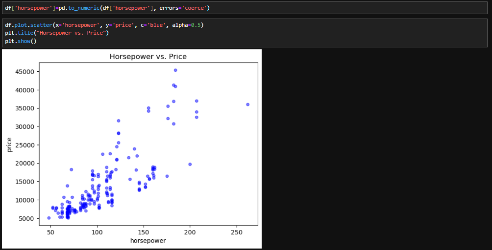  

### 3] Histogram:
The histogram is typically used to divide the data in a set of bins (either equally in number of bins or ranges) and representing these bins w.r.t. their frequencies of occurance. Here we use the `plt.hist()` method.  
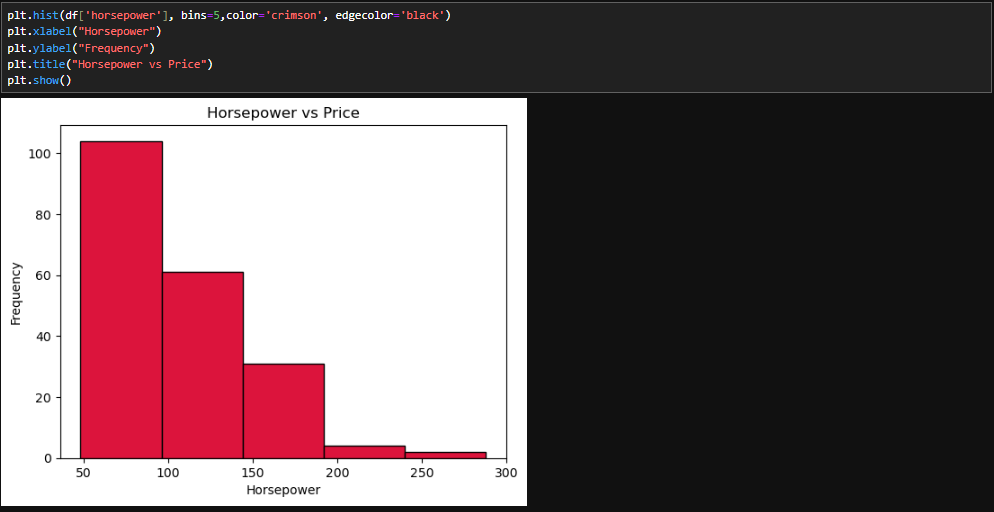  
Here, the bins were automatically divided from min to max in equal parts. What if I want to set the ranges of the edges myself? Then we first define the custom list ourselves and then set it into the bins attribute.  
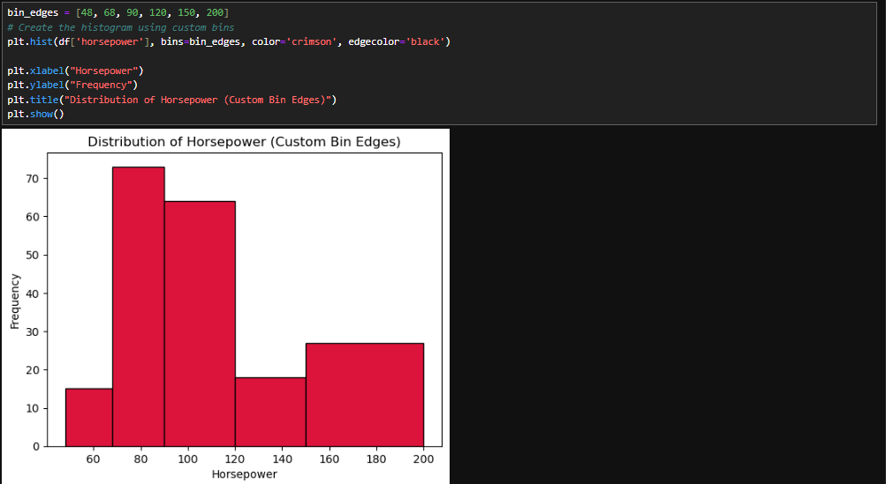  

### 4] Bar Plots:
The bar plots are great when it comes to visualize the categorical data. Here, the values on the Y-axis is actually the average frequency of a row's particular category (i.e. column value) w.rt. the category name given along the x-axis. There can be two major types of bar plots:  

- 1) Displaying one's own categories' frequencies:  

We make a panda series that stores the values as the respective category's count in the column.  
```python  
category_counts=df['Manufacturer'].values_count()

plt.bar(category_counts.index, category_counts.values, color='greenyellow', width=0.6)

plt.xlabel('Manufacturer')
plt.ylabel('Number of Laptops')
plt.title("Number of laptops per manufacturer")
plt.xticks(rotation=45)  #Rotating x-axis titles by 45 degrees
plt.show()

```  
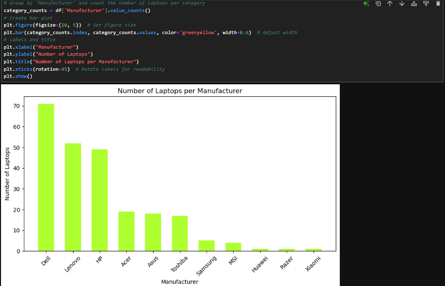  

- 2) Displaying the graph that compares the average value of a category against a particular category:  

We make a panda series that groups the `df['Manufacturer']` column with values equal to the average of the "CPU Frequency" of each respective category from the `df['CPU_frequency']` column.  
```python
df_grouped=df.groupby('Manufacturer')['CPU_frequency'].mean()
plt.figure(figsize=(10,5)) #Predefines the plot size to width 10 and height 5
plt.bar(df_grouped.index, df_grouped.values, color='greenyellow', width=0.6)
plt.ylabel("Average CPU Frequency (GHz)")
plt.title("Average CPU frequency vs Manufacturer")
plt.xticks(rotation=45)

```
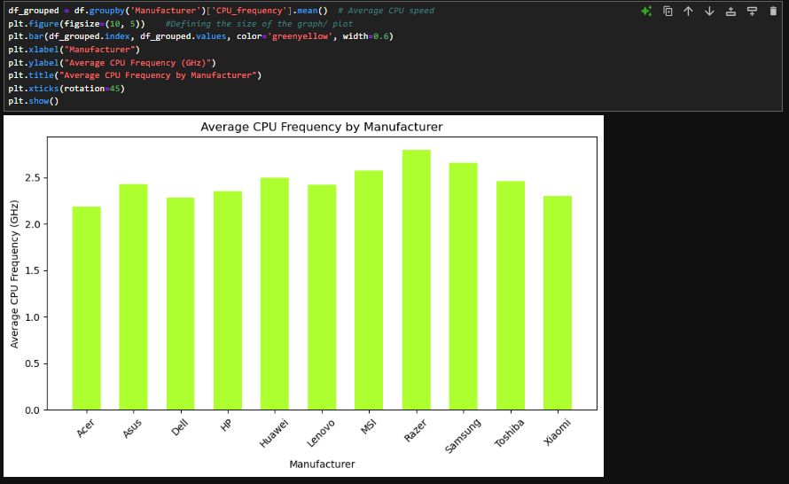  

### 5] Regression Plots:  
This plot draws a scatter plot of numeric values along both the axes and also shows the resulting regression line along with a 95% confidence interval by applying the regression model upon it. The x and y parameters can be passed as it is along with the dataframe as the value of the data attribute ordirectly as the dataframe columns.  
Eg: Laptop weight vs Price:  
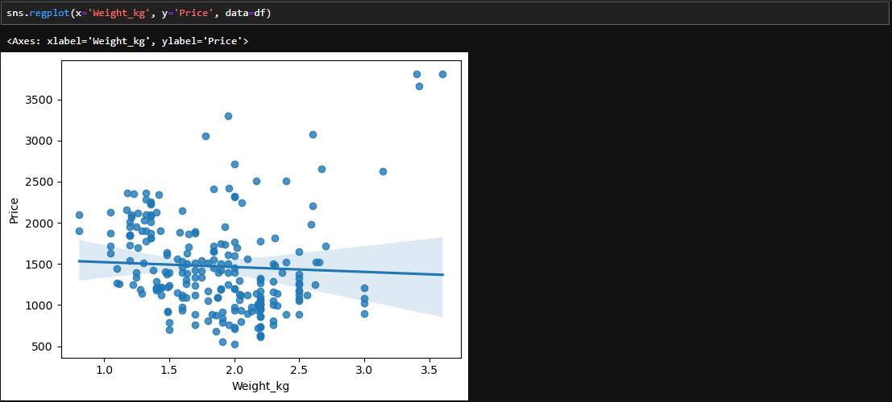  

Eg2: Laptop Screen Size vs Price:  
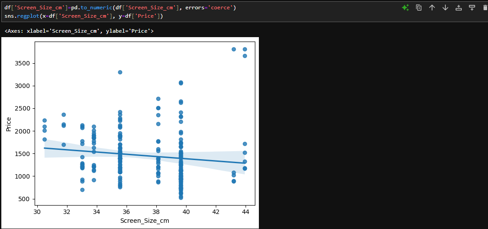  

### 6] Box Plots:  
Already explained these in the [Descriptive Statistics](Chapter3.2.md) Click [here](https://github.com/parthpakhare-dotcom/Data-Analysis-with-Python/blob/main/Chapter3.2.md#using-box-plots) to read it.  

### 7] Residual Plots:  
Residuals are the differences between the actual values (observed values) and the predicted values by the regression model. A residual plot plots residuals on the Y-axis and the independent variable (or predicted values) on the X-axis. A residual plot is a graphical representation used in regression analysis to assess the goodness of fit of a model. It helps identify whether the assumptions of linear regression are met. Eg., If the residuals are randomly scattered around zero, the model is a good fit. Or, if the residuals form a U-shape or an inverted U-shape, it indicates a non-linear relationship. A linear model may not be appropriate in that case.  
Following is the syntax:  
```python
sns.residplot(x=df['header_1'], y=df['header_2'])  
```
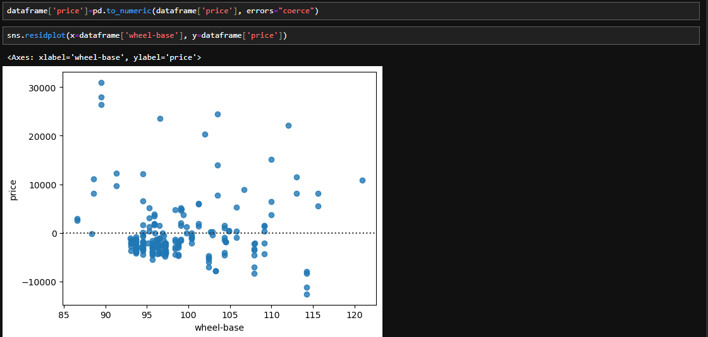  

### 8] KDE Plot:  
A KDE (Kernel Density Estimation) Plot is a smoothed histogram that estimates the probability density function (PDF) of a continuous variable. It helps visualize the distribution of data points in a way that removes the randomness of a traditional histogram. Instead of counting the frequency of data points in bins (like a histogram), KDE places a smooth curve over each data point. The result is a continuous density curve that represents where data points are concentrated.  
Creating a KDE in Python using Seaborn:  
```python
import seaborn as sns
sns.kdeplot(df['header'], color="indigo", fill=True)  #fill attribute fills the curve within the boundaries in the given color's lighter shade  
```  
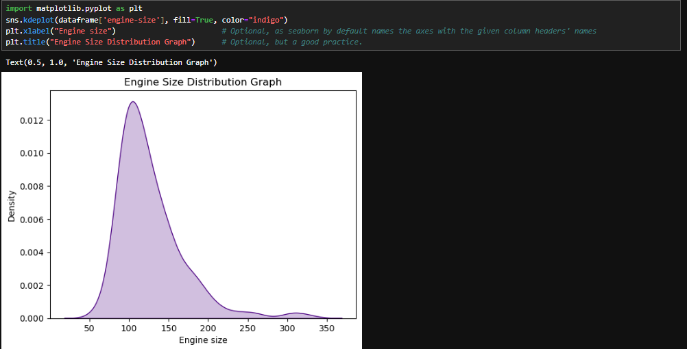

### 9] Distribution Plots: 
These plots are a combination of histograms and the KDE plot. It keeps the equidistant histogram bins in the background as a reference. However, changing the `hist` attribute in the function `sns.distplot()` to `False` can remove the histograms and only the plain KDE is displayed. Obviously, by default, this parameter is `True`.  
- Displaying the distribution plot:  
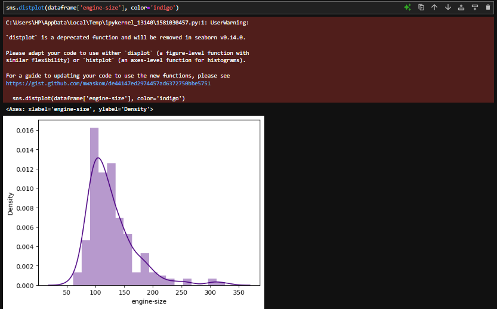  

- Displaying the distribution plot without histogram bins:  
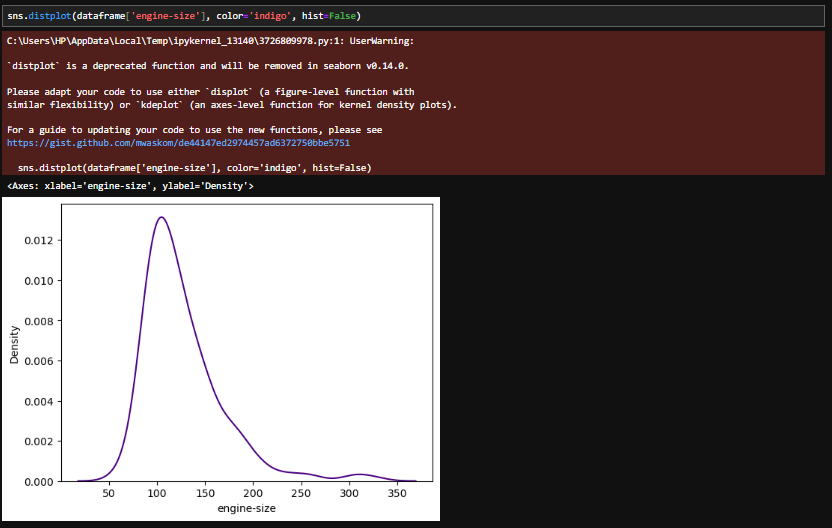  

Actually as mentioned above, the `distplot()` function is now deprecated. The why's and how's can be read [here](https://gist.github.com/mwaskom/de44147ed2974457ad6372750bbe5751). Alternatively we can use the `histplot()` function by giving the value of `kde` attribute as true.  
```python
sns.histplot(dataframe['engine-size'], kde=True)
```  
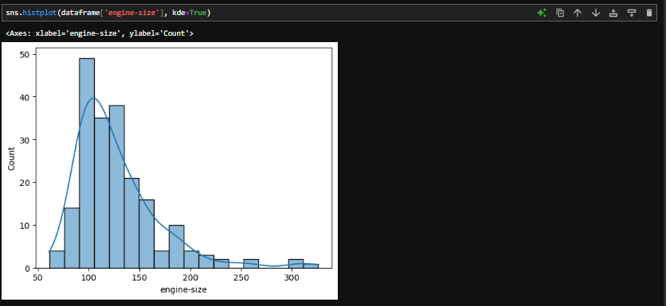  

Fin.(+_+)