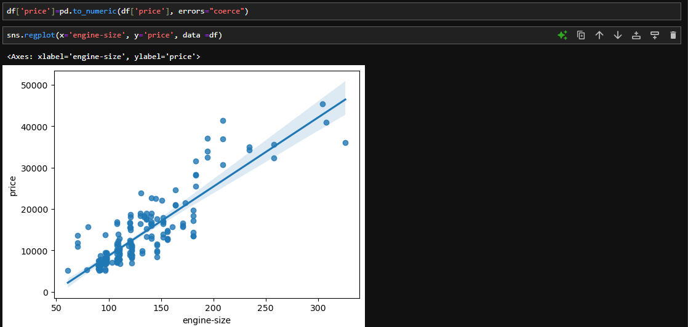
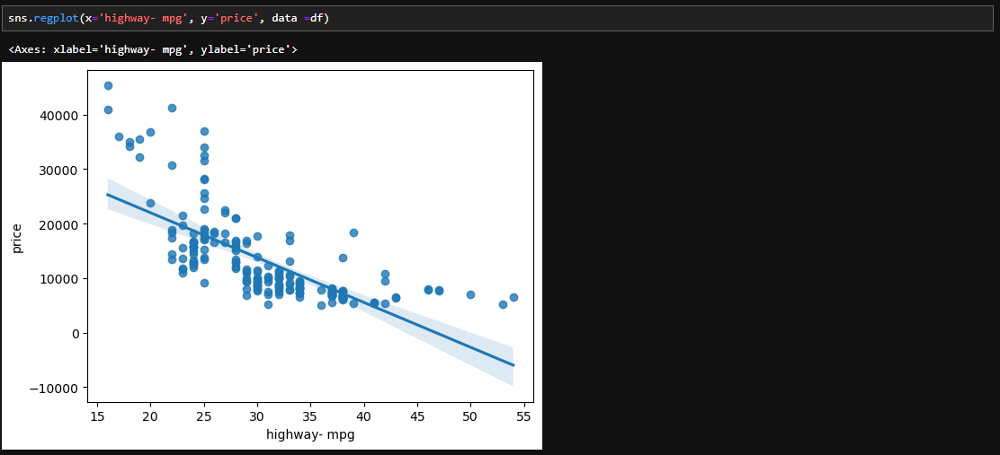
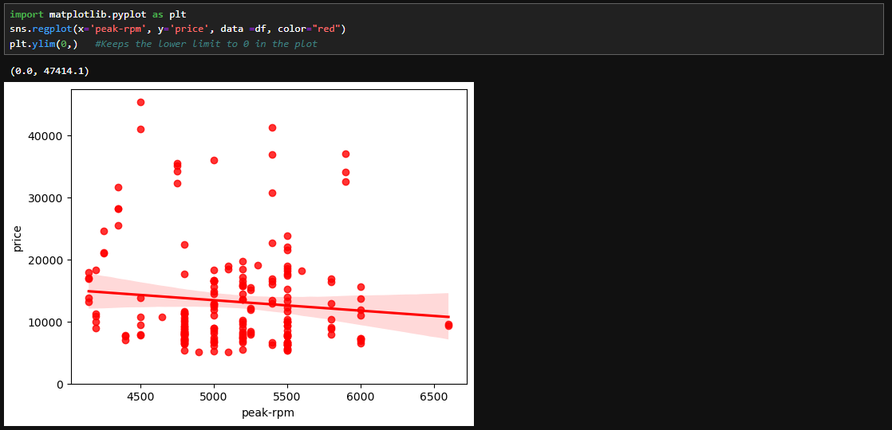

# 🌌 Correlation

Correlation simply refers to at how much extent are two variables interdependent. Thus, the decline or growth of one variable also means the similar for the other.  
<ul>For Eg:  
    <li> Lung Cancer -> Smoking
    <li> Rain -> Umbrella
</ul>  
Here, for the variable Lung Cancer, as the extent of smoking rises, so does the proportion of Lung Cancer in a set of people. However, correation doesn't necessarily direct to caution as Rain is a factor which leads to people using more umbrella but isn't really the direct reason of using it solely. Though correlated terms have common backgrounds mostly.  

1) Positive Linear Relationship:  
Eg can be seen between the variables: `engine-size` and `price`.  
  

2) Negative Linear Relationship:  
Eg can be seen in between the variables: `highway-mpg` and `price`. The price generally decreases as the highway mpg factor increases.  
  

3) Weak correlation:  
Eg can be seen in between the variables: `peak-rpm` and `price`. Here, for both low and high `peak-rpm`, there are low and high prices. Thus, the regression plot also has no steep slope or curve.  

