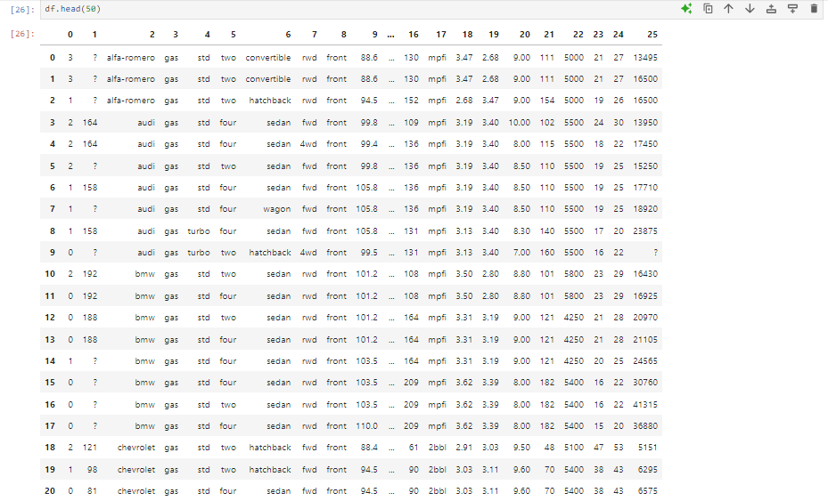

# 🌟 Chapter 3: Importing and Exporting Data in Python

Now, we'll see how to read the data using Python's Panda package.

To read the data using Pandas in Python there are two important factors:  
_  
**1] Format:-**  
This the format in which the file is encoded. It can usually be identified by the ending of the file name (eg CSV, JSON, HDF, XLSX, etc.).  
**2] File path:-**  
This indicates where the file is indicated. It can be the server directory or the remote link on a webpage.
Last time we saw the file data in the .csv format. Even though we cannot fastly make sense of the data in the given format, reading such data with Pandas makes it accessible.  

### Reading the data in Pandas can be done in three lines:
- Importing the Pandas with a Variable.
- Declare a variable with the value of the path to the CSV file.
- Use the "read_csv" data function to import the data.

Eg:  
`import pandas as pd`                                                                   ## an object pd of class pandas is made  
`url="https://archive.ics.uci.edu/ml/machine-learning-databases/autos/imports-85.data"` ## a string of url is saved in the variable  
`df=pd.read_csv(url)`                                                                   ## the in-built member fuction read_csv is called by the object  

Or simply as,  
`import pandas as pd`  
`df=pd.read_csv("https://archive.ics.uci.edu/ml/machine-learning-databases/autos/imports-85.data")`  

Now, an important note is that, the read_csv function considers the first line to be the header by default. But our csv file has no header. Thus, we specify header to none:  
`import pandas as pd`  
`url="https://archive.ics.uci.edu/ml/machine-learning-databases/autos/imports-85.data"`  
`df=pd.read_csv(url, header=None)`  

Thus, the dataset is read into the 2D table called the data frame succesfully.  
To test it out, we can print the dataframe by simply writing `df`. But as it may take extra time and resources in some unneeded cases, we can simply print the first n rows as:  
`df.head(50)`  

Similarly, to show the bottom n rows, we use:  
`df.tail(10)`  

We mentioned `None` for header. Thus, integers were automatically given in their place. If not given in the first columns itslef, a row of header can be given as a list of strings of column names and passed to the `column` attribute in the dataframe like below.  

`headers = ["symboling","normalized-losses","make","fuel-type","aspiration", "num-of-doors","body-style", "drive-wheels","engine-location", "wheel-base", "length","width","height", "curb-weight", "engine-type", "num-of-cylinders", "engine-size","fuel-system", "bore","stroke","compression-ratio","horsepower", "peak-rpm","city-mpg","highway- mpg", "price"]`  
`df.columns=headers`  
`df.head(5)`  

### Exporting the data
After you have done some operations on your dataframe (will be discussed later), if we want to export it as a new csv file in our computer, we simply run the following commands.  
`path=r"C:\Users\HP\Downloads\Exportingautomobiles.csv" ## Directory and desired file name`  
`##Note, we made the string for path a raw string, as String can't process '\' normally`  
`df.to_csv(path)`  

This makes the file exported with the `to_csv` function.
In this way, Pandas support import and export of different file formats like:  
`CSV`  
`JSON`  
`EXCEL`  
`SQL`  Eg. `read_sql()` to import and `to_sql()` to export.  

---