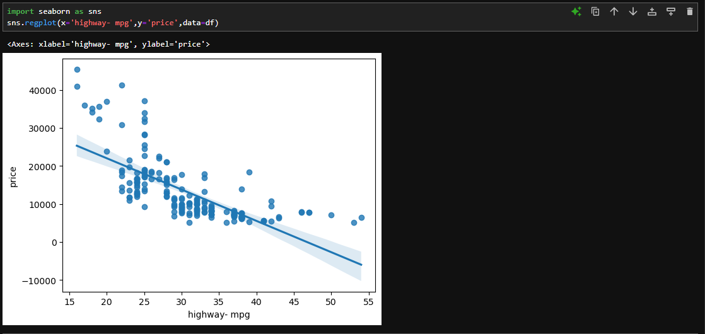
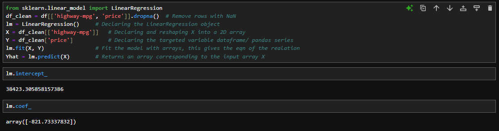

# 🌒 Linear Regression and Multiple Linear Regression: 

## Introduction:
1) Linear regression refers to one independent variable helping to make a predication.  
    `independent variable Xi,` ⏭️ **Linear Regression** ⏭️ `prediction`
   
2) Multpile Regression will refer to multiple independent variables to help make a prediction.  
    `multiple independent variables`     ⏭️ **Multiple Regression** ⏭️ `prediction`
   `x<sub>1</sub>,...., x<sub>d</sub>`

## Simple Linear Regression (SLR):
This is a method of understanding the relationship between the two variables:  
- The predictor (independent) variable - x
- The target (dependent) variable - y
We show the linear relationship between these two using the equation:  
          `y= b0 + b1*x`
  where,
  b0 => **the intercept** and,
  b1 => **the slope**  
Finding these values itself requires a lot of maths but finding them is necessary to form the model; we will do that using the pre-defined modules.

Steps for model development using SLR:  
### Prediction: 
To figure out the cost of a car, if we have the linear relationship equation between the variables, we can formulate the model to determine the price. Let the known variable be `highway-mpg`.  
Eg: Say, the eqn between them is as:  
`y = 38423 - 821(x)`,  
if the known `highway-mpg` is "20", the price will be:  
`y = 38423 - 821(20)` = `22003`

  
To create a line prediction, we take the data points from our data set which are the known results from the effect of the first variable.  

### Fit:
These are the training points for our model. This is called as the process to `fit` in the model.
  
Taking these results,which we call as the `parameters`, we store them ( `(a1,b1)`, `(a2,b2)`, etc. ) each in each dataframes (pandas) or Numpy arrays as:  
  
Each sample corresponds to each row in the arrays/ dataframes.

### Noise:  
Usually many other factors that are not even considered affect the target variable. Eg, in our case, the price of used car can be affected by how old it is.  
This uncertainty is already considered by assuming a small random value will be added in the line. This is called as the noise. In theorotical terms, the noise is governed by the Gaussian (normal) distribution with mean 0 and some variance σ^2.  
As seen in the diagram below, as the value of noise increases (in negative or positive direction), it's probability of occuring reduces. The probability of no noise is actually the largest.  
  

Sometimes, large values are added or subtracted. But for the most part, the values added are near zero.  
  

Thus, using the training points ( and ignoring the considerable noise) we now make a model represented by the equation:  
  
Notice how we gave a hat on the y variable in this equation. This shows that the model, though can predict the targeted variable, isn't always perfect. I have added a regression plot here.  
  

There can be other reasons than noise if the difference is really big in many casses.

### SLR in Python:
1) Import linear_model from scikit-learn:  
   `from sklearn.linear_model import LinearRegression`
   
2) Create a Linear Regression object using the Constructor:  
    This object is used for applying the Linear Regression operations. 
    `lm = LinearRegression()` 

   
5) Define the predictor and target variables:  
    ```python
    X = df_clean[['highway-mpg']]
    Y = df_clean['price'] 
    ```
    Note that the X is passed as a 2D array containing the pandas series.

6) Fit the models with the parameters from the dataframes X and Y  
    `lm.fit(X,Y)`

7) Obtain the prediction:  
    The prediction from the input X is the output array Yhat obtained with the `predict()` function.
    `Yhat = lm.predict(X) `

The output is an array having predicted outputs corresponding to the input X.

Now, we can directly view the intercept and slope of the plot as:  
`lm.intercept_` for the _b0_ factor, and  
`lm.coef_` for the _b1_ factor.


Using these values, the equation formed is:  
**Price= 38423.31 - 821.73 * highway-mpg**
