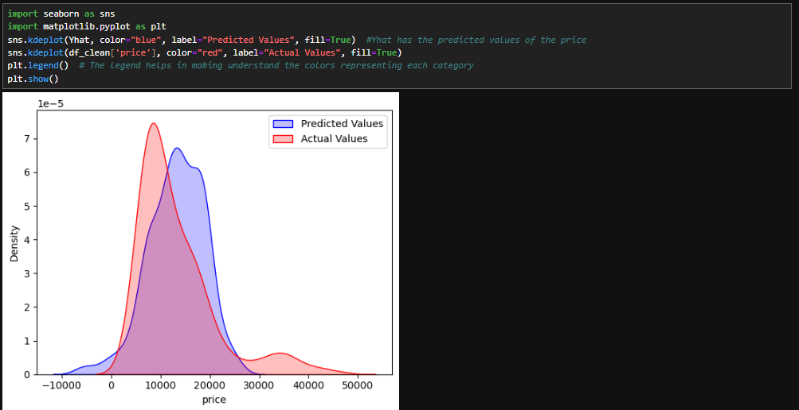
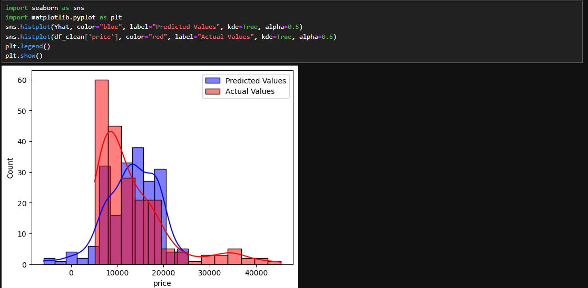

# 🌒 Model Evaluation using Visualisation

Understanding the grapical representation of the model makes it more easier to find its nature. There are several ways to do the model evaluation with the graphs:  

### Regression plot
[Read here](https://github.com/parthpakhare-dotcom/Data-Analysis-with-Python/blob/main/Chapter3.4.md#5-regression-plots)  
### Residual plot
[Read here](https://github.com/parthpakhare-dotcom/Data-Analysis-with-Python/blob/main/Chapter3.4.md#5-regression-plots)  

---

The information on the two of the above is already given in [Chapter3.4.md](Chapter3.4.md). The links are provided.

### Distribution plot
As seen earlier, the distplot module is deprecated. Thus we use the normal KDE plots or the histplots only in its place. Read more on KDE from this [link](https://github.com/parthpakhare-dotcom/Data-Analysis-with-Python/blob/main/Chapter3.4.md#5-regression-plots) and basics of distribution plots [here](https://github.com/parthpakhare-dotcom/Data-Analysis-with-Python/blob/main/Chapter3.4.md#5-regression-plots) . These plots by themselves represent the distribution of a data variable over the other. Using multiple axis parameters, a comparison graph can be plotted. Here, we will show how the distributions of the predicted values of the `price` by the model created previously (having the predicted values stored in the Yhat dataframe) differs from that of the actual `price` variable in the dataset. These are the ways to do so:  
- Using the KDE plot:  
```python
import seaborn as sns
import matplotlib.pyplot as plt
sns.kdeplot(Yhat, color="blue", label="Predicted Values", fill=True)
sns.kdeplot(df_clean['price'], color="red", label="Actual Values", fill=True)
plt.legend()
plt.show()
```  
  

- Using the histplot:  
```python
import seaborn as sns
import matplotlib.pyplot as plt
sns.histplot(Yhat, color="blue", label="Predicted Values", kde=True, alpha=0.5)  
sns.histplot(df_clean['price'], color="red", label="Actual Values", kde=True, alpha=0.5)
plt.legend()
plt.show()
```  
Here, alpha=0.5 makes the bars slightly transparent so both distributions are visible.
