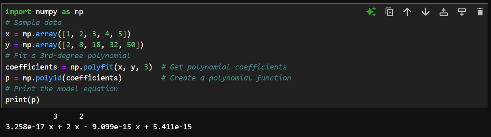
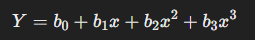
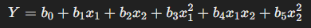
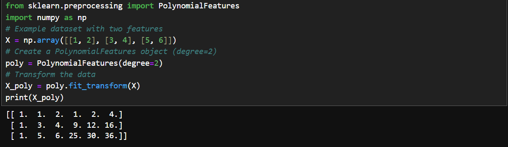
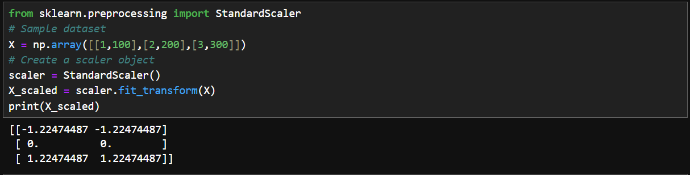
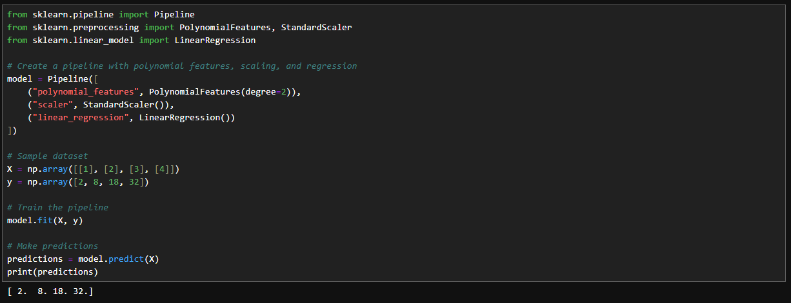
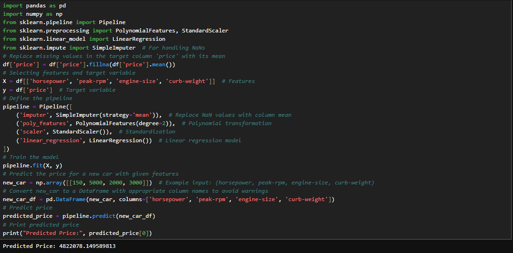

# 🌓 Polynomial Regression and Pipelines

We have already seen in the residual graphs that if the residuals form a U-shape or an inverted U-shape, it indicates a non-linear relationship. A linear model may not be appropriate in that case. In such cases, we use the polynomial regression.  

### 1] What is Polynomial Regression?  
- Polynomial Regression is a special case of linear regression where we transform the predictor variable into a polynomial.  
- The model still fits a linear equation, but the features (independent variables) are transformed into polynomial terms.  

### 2] What is a Curvilinear Relationship?  
- A curvilinear relationship means that the relationship between the variables follows a curve rather than a straight line.  
- We achieve this by squaring or cubing the predictor variable to add higher-order terms.  

- Examples of Polynomial Regression Models:  
```
1) Quadratic – 2ⁿᵈ order
Ŷ = b₀ + b₁x₁ + b₂(x₁)²  
2) Cubic – 3ʳᵈ order
Ŷ = b₀ + b₁x₁ + b₂(x₁)² + b₃(x₁)³  
3) Higher order
Ŷ = b₀ + b₁x₁ + b₂(x₁)² + b₃(x₁)³ + ...  
```  

### 3] Impact of Polynomial Degree  
Choosing the right degree is crucial:
- Low-degree polynomial may not capture the variation.
- High-degree polynomial may overfit the data.  
Graphs can help visualize how the function changes with different degrees.  

### 4] Polynomial Regression in Python  
We use NumPy's `polyfit()` function to generate polynomial regression models. Further we use the `poly1d()` function to give out the equation.   
```python
import numpy as np
x = np.array([1, 2, 3, 4, 5])
y = np.array([2, 8, 18, 32, 50])
coefficients = np.polyfit(x, y, 3)
p = np.poly1d(coefficients)     
print(p)
```
  
Here, the output represents the equation: `Y = -1.557(x³) + 204.8(x²) + 8965(x) + 1.37 × 10⁵`.  

### 5] Multidimensional Polynomial Regression  
When there are multiple features, polynomial regression gets more complex.  
So far, we have seen simple polynomial regression, where we have only one input feature (x). But what if we have multiple features (x₁, x₂, x₃, etc.)? This is called Multidimensional Polynomial Regression.  
In a simple polynomial regression model, our equation looks like this:  
  
But what if we have multiple input variables (e.g., x₁ and x₂)?  
  
This is a 2nd-order polynomial regression with two features (x₁, x₂), thus multi-dimensional.  
NumPy’s polyfit() cannot handle multi-dimensional polynomial regression. Instead, we use scikit-learn’s `PolynomialFeatures`.  

### 6] How to Use PolynomialFeatures in Scikit-learn
The `PolynomialFeatures` class transforms features into polynomial features.  
```python
from sklearn.preprocessing import PolynomialFeatures
import numpy as np
X = np.array([[1, 2], [3, 4], [5, 6]])
poly = PolynomialFeatures(degree=2)
X_poly = poly.fit_transform(X)
print(X_poly)
```  
If X = [[1,2], [3,4], [5,6]], the transformed features will be:  
```
[[1, 1, 2, 1, 2, 4],  
 [1, 3, 4, 9, 12, 16],  
 [1, 5, 6, 25, 30, 36]]
```  
For each input row [x₁, x₂], the transformation added:  
Bias term (1)  
Original features: x₁, x₂  
Squared terms: x₁², x₂²  
Interaction term: x₁ * x₂  

#### Why only degree 2?  
The choice of degree = 2 was just an example. You can use higher degrees depending on the complexity of the data.

##### 🔹 Why Start with Degree 2?
- Degree 2 (Quadratic) captures basic curvature in data.
- Degree 3+ (Cubic, etc.) captures more complex patterns but can lead to overfitting if not handled properly.
- Higher degrees increase model complexity and computational cost.  

  

### 7] Feature Scaling (Normalization)
When features have different scales, we use normalization. Scikit-learn's StandardScaler helps scale features.  
```python
from sklearn.preprocessing import StandardScaler
X = np.array([[1,100],[2,200],[3,300]])
scaler = StandardScaler()
X_scaled = scaler.fit_transform(X)
print(X_scaled)
```
  

This ensures that features are on the same scale.  

### 8] Pipeline
- A pipeline simplifies the process by chaining multiple steps together.
- Instead of manually applying transformations and regression, a pipeline automates the process.  
Steps in a Pipeline
- Polynomial transformation
- Feature normalization
- Linear regression
- Prediction

### 9] Implementing a Pipeline in Python
Here is a pipelined set of operations that carry out transformation, normalization, regression with thw `fit()` function and prediction with the `predict()` function.  
```python
from sklearn.pipeline import Pipeline
from sklearn.preprocessing import PolynomialFeatures, StandardScaler
from sklearn.linear_model import LinearRegression
model = Pipeline([
    ("polynomial_features", PolynomialFeatures(degree=2)),
    ("scaler", StandardScaler()),
    ("linear_regression", LinearRegression())
])
X = np.array([[1], [2], [3], [4]])
y = np.array([2, 8, 18, 32])
model.fit(X, y)

predictions = model.predict(X)
print(predictions)
```


#### Creating an actual model out to predict the price from various variables:  
Here is the pipelined model of the price predictor.  
```python
import pandas as pd
import numpy as np
from sklearn.pipeline import Pipeline
from sklearn.preprocessing import PolynomialFeatures, StandardScaler
from sklearn.linear_model import LinearRegression
from sklearn.impute import SimpleImputer
df['price'] = df['price'].fillna(df['price'].mean())
X = df[['horsepower', 'peak-rpm', 'engine-size', 'curb-weight']]
y = df['price']
pipeline = Pipeline([
    ('imputer', SimpleImputer(strategy='mean')),
    ('poly_features', PolynomialFeatures(degree=2)),
    ('scaler', StandardScaler()),
    ('linear_regression', LinearRegression())
])
pipeline.fit(X, y)
new_car = np.array([[150, 5000, 2000, 3000]])
new_car_df = pd.DataFrame(new_car, columns=['horsepower', 'peak-rpm', 'engine-size', 'curb-weight'])
predicted_price = pipeline.predict(new_car_df)
print("Predicted Price:", predicted_price[0])
```  
  

We return `predicted_price[0]` instead of `predicted_price` as `predicted_price` returns an array storing predictions. Since, here we're dealing with only one value, it's in the starting (0th) index. Thus `predicted_price[0]`. Using `predicted_price` directly will give the output as an array element like `[4822078.14958981]` instead of `4822078.149589813`.  
