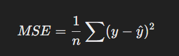
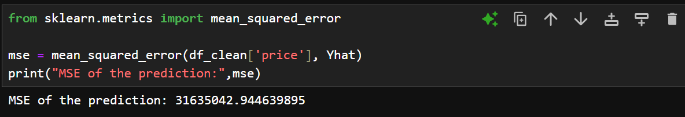
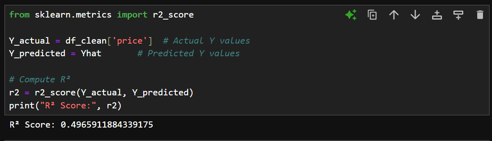

# 🌔 Measures for In-Sample Evaluation  
## 1] Understanding Model Evaluation
After visualizing a model, we need a way to numerically evaluate how well it fits the data. Two important in-sample evaluation metrics are:
- **Mean Squared Error (MSE)**
- **R-Squared (R², Coefficient of Determination)**
These help us measure the accuracy of our model when predicting outcomes based on input data.

## 2] Mean Squared Error (MSE)
MSE tells us how far off our model's predictions are from the actual values. It is calculated as:  
  
where,  
y = actual value
Ŷ= predicted value
𝑛 = number of data points
Here we compare and take the difference of the corresponding actual data and predicted data and divide it by the frequency after squaring the difference.

### MSE in Python  
There is an inbuilt `mean_squared_error()` function in the `metrics` class of the scikitlearn library for getting the mean square error.  
```python
from sklearn.metrics import mean_squared_error
y_actual = df_clean['price']
y_predicted = Yhat
mse = mean_squared_error(y_actual, y_predicted)
print(mse)
```  
  

## 3] R-Squared (R² - Coefficient of Determination)

R² measures how well our regression model fits the data. It tells us what percentage of the variance in the dependent variable is explained by the independent variable.  
  
where:
- 𝑀𝑆𝐸model = MSE of the regression model
- 𝑀𝑆𝐸mean = MSE of a simple model that just predicts the mean of 𝑦 (baseline model)  

**Understanding R²**  
- If R² = 1 → Perfect fit (model explains all variance)
- If R² = 0 → Model is no better than just predicting the mean
- If R² is negative → Model performs worse than a simple average, indicating overfitting or incorrect assumptions.  

**Example Calculation**  
- Given actual values 𝑦 = [4,5,6,7]
- Mean of y (ydash) = 5.5
- Compute MSE of the regression model and MSE of just using mean (baseline model)  
a) If regression model's MSE is small, R² is close to 1 (good fit).  
b) If regression model's MSE is large, R² is close to 0 (poor fit).  This can be due to overfitting

### R² in Python
```python
from sklearn.linear_model import LinearRegression
import numpy as np

# Example data
X = np.array([1, 2, 3, 4, 5]).reshape(-1, 1)  #reshape function is used to convert the X array (numpy arrays need this to be done) to two dimensional. The fit function expects a 2D array to be passed
y = np.array([2, 4, 5, 4, 5])
# Train model
model = LinearRegression()
model.fit(X, y)
# Compute R²
r_squared = model.score(X, y)
print("R-Squared:", r_squared)
```  

  
Here R² score is 0.4966 (approximately 49.66%), which means the model explains about 49.66% of the variance in the target variable (price).

How to Interpret This Score?
- Near 1 (e.g., 0.8 - 1.0) → Very good model (strong fit).
- Around 0.5 (your case: 0.4966) → Moderate fit (the model explains some variance but has room for improvement).
- Near 0 (e.g., 0.0 - 0.3) → Weak fit (model is not much better than guessing the average).
- Negative → The model is worse than a simple mean predictor (bad fit, possible overfitting).