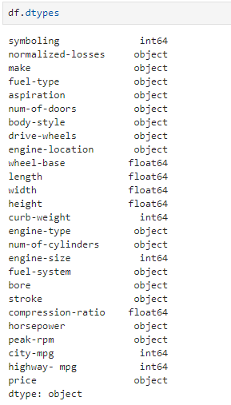
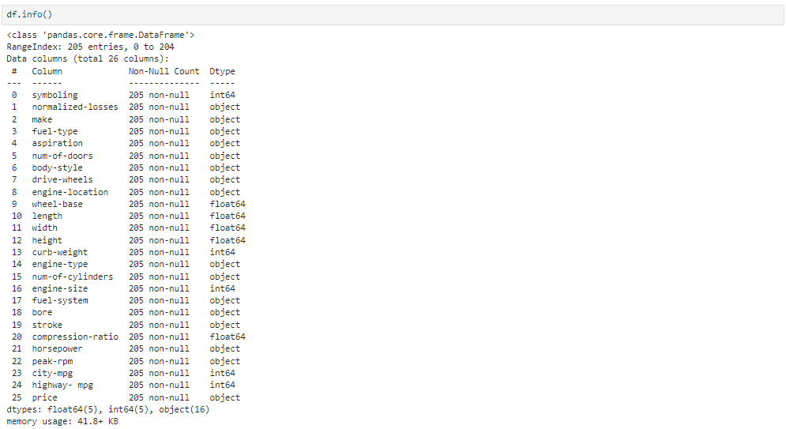

# 🌟 Chapter 4: Getting Started Analyzing data in Python

Considering that we've gotten the idea of importing the datasets, let's start with analysing it by using the Pandas.
Pandas has several built in methods that can be used to understand the data type of features or to look at the distribution of data within the dataset. Using these methods gives an overview of the dataset and also points out potential issues such as the wrong data type of features which may need to be resolved later on.  
There are various types of Data. The main data types in Pandas are `object`. `int64` and `float64`. They're the same as the data types `strings`, `int` and `float`, respectively, in the native Python.  
The `datetime` data type is important to show the time relative data.  
Pandas, like normaly in Python langauge, automatically assigns the data type to certain values. But for a number of reasons, the assigned data type can be error prone. Like eg: the column, `car-price` has numerical values and naturally it must be in the numerical data type like `float` to make calculations on it. But the Pandas may assign it with the `object` data type. Similarly, if there's some column about the bumber plates, having assigned the object data type would make more sense.  

When the data tyes method, `dtypes` is applied to the data frame, the data type of the each column is returned in a series. Eg:  
`df.dtypes`  
  

Intuitively, most of the data types appearing above are right. Eg, the `make` column consists of variety of names, thus an  `objects`. However, notice that the data for the bore column are understood as `objects`, while they represent the dimensions in engines, thus should be of type `float`. Thus, such types are to be corrected (how will be seen later).  

### Statistical Summary of the dataframe
For this, we use the `describe()` method. For a specific column, it returns:  
- `count`: Number of terms in the column.  
- `mean`: Average column value  
- `std`: Column's standard deviation  
- `min`: Minimum values  
- `max`: Maximum values  
- `25%`: 25% of all the occurances  
- `50%`: 50% of all the occurances  
- `75%`: 75% of all the occurances  
  

Notice how by default the columns only with numerical data are analysed with the describe function. Though it can work forthe object type as well. To enable the summary of all the columns, we can add an argument `include` with value `"all"`. Now, we can see that for the `object` data type columns, a diff set of statistics is evaluated. Like unique, top and frequency:  
- `unique`: Number of distinct objects in the column   
- `top`: Most frequently occuring object  
- `freq`: Frequency of the top object in the column  
 
Some values in the table are given as `NaN`, meaning "Not a Number". It's because, that particular statistical metric is not made to calculate the values in a column with the given data type.  

 

Another function to check the data set is `info()` function. It gives the consise summary of the data set.  

---