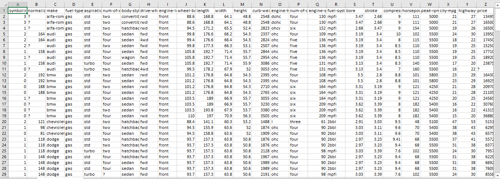

# 📚 Module 1:

---

## 🌟 Chapter 1: Understanding the Data

The data set that we are using is the open dataset by Jeffery C Schlimmer on the used car prices. The data is in CSV (comma seperated values) format.  
In a CSV file, each of the values are seperated by commas.This makes it easier to import in most tools and applications.  

Each line represents the row in the data set.
See the data set on this [link](https://archive.ics.uci.edu/ml/machine-learning-databases/autos/imports-85.data) or [click](Automobile_data.csv) to download it (cleaner version).  

If you clink on link above, the displayed data doesn't appear to have any heading, but one can modify the csv file to include the headings for each attribute.  

The various parameters in commas respectively will be in the respective coloumns. Like first elements in each of the rows (lines) represent the symbolings describing the risk factor (above 0, it becomes riskier) associated with a particular used car in the row.  
The second attribute normalized losses shows the average loss on a certain car's insurance for a year. This number can range from 65-256 for various types of automobiles like two-door, small, station wagons, sports/specialty, etc.  

Going down, the last and 26th attribute is the "price". This is our target attribute or "label". our goal will be to analyze all the other car features like symbolings, normalized-losses, fuel-type, etc. and based on them predict the price of a car if certain valued for the attributes are passed.  

---

 
  

 

 

  
## 🌟 Chapter 2: Python Packages for Data Science  

The Python language has a lot of libraries that we can import to use a collection of in-built functions. These functions make the task of analyzing the data very easy with just a few lines of code.  

_These Libraries are classified as:_  
1] **Scientific Computing** Libraries:- (For calculations)  

***Pandas***: Offer essential data structure and tools for effective data manipulation and analysis. Especially used for 2D tables called data frames, Pandas come with easy indexing functionality.  

- ***NumPy***: It uses arrays for i/ps and o/ps. It can be extended to objects for matrices.  

- **_SciPy_**: It includes functions for mathematical operations like calculus, optimization and visualization.  

2] **Vizualization** Libraries:- (For visualization)  
These libraries are the best to represent the results of the data to others as they communicate about the data in visuals.  

- **_Matplotlib_**: To make highly customizable plots and graphs  

- **_Seaborn_**: Based on Matplotlib, it is a high level visualization library used to generate plots like heat maps, time series and violin plots.  

3] **Algorithmic** Libraries:  
These are used to create models based on our data sets using machine learning and make predictions.  

- **_Scikit-learn_**: Contains tools for statistical modelling such as regression, classification, clustering, etc. The library is itself built on NumPy, SciPy and Matplotlib.  

- **_Statsmodels_**: Explores data, estimate statistical models, and perform statistical tests.

---

 
  

 

 

## 🌟 Chapter 3: Importing and Exporting Data in Python

Now, we'll see how to read the data using Python's Panda package.

To read the data using Pandas in Python there are two important factors:  
_  
**1] Format:-**  
This the format in which the file is encoded. It can usually be identified by the ending of the file name (eg CSV, JSON, HDF, XLSX, etc.).  
**2] File path:-**  
This indicates where the file is indicated. It can be the server directory or the remote link on a webpage.
Last time we saw the file data in the .csv format. Even though we cannot fastly make sense of the data in the given format, reading such data with Pandas makes it accessible.  

### Reading the data in Pandas can be done in three lines:
- Importing the Pandas with a Variable.
- Declare a variable with the value of the path to the CSV file.
- Use the "read_csv" data function to import the data.

Eg:  
`import pandas as pd`                                                                   ## an object pd of class pandas is made  
`url="https://archive.ics.uci.edu/ml/machine-learning-databases/autos/imports-85.data"` ## a string of url is saved in the variable  
`df=pd.read_csv(url)`                                                                   ## the in-built member fuction read_csv is called by the object  

Or simply as,  
`import pandas as pd`  
`df=pd.read_csv("https://archive.ics.uci.edu/ml/machine-learning-databases/autos/imports-85.data")`  

Now, an important note is that, the read_csv function considers the first line to be the header by default. But our csv file has no header. Thus, we specify header to none:  
`import pandas as pd`  
`url="https://archive.ics.uci.edu/ml/machine-learning-databases/autos/imports-85.data"`  
`df=pd.read_csv(url, header=None)`  

Thus, the dataset is read into the 2D table called the data frame succesfully.  
To test it out, we can print the dataframe by simply writing `df`. But as it may take extra time and resources in some unneeded cases, we can simply print the first n rows as:  
`df.head(50)`  

Similarly, to show the bottom n rows, we use:  
`df.tail(10)`  

We mentioned `None` for header. Thus, integers were automatically given in their place. If not given in the first columns itslef, a row of header can be given as a list of strings of column names and passed to the `column` attribute in the dataframe like below.  

`headers = ["symboling","normalized-losses","make","fuel-type","aspiration", "num-of-doors","body-style", "drive-wheels","engine-location", "wheel-base", "length","width","height", "curb-weight", "engine-type", "num-of-cylinders", "engine-size","fuel-system", "bore","stroke","compression-ratio","horsepower", "peak-rpm","city-mpg","highway- mpg", "price"]`  
`df.columns=headers`  
`df.head(5)`  

### Exporting the data
After you have done some operations on your dataframe (will be discussed later), if we want to export it as a new csv file in our computer, we simply run the following commands.  
`path=r"C:\Users\HP\Downloads\Exportingautomobiles.csv" ## Directory and desired file name`  
`##Note, we made the string for path a raw string, as String can't process '\' normally`  
`df.to_csv(path)`  

This makes the file exported with the `to_csv` function.
In this way, Pandas support import and export of different file formats like:  
`CSV`  
`JSON`  
`EXCEL`  
`SQL`  Eg. `read_sql()` to import and `to_sql()` to export.  

---
  
  
  

## 🌟 Chapter 4: Getting Started Analyzing data in Python

Considering that we've gotten the idea of importing the datasets, let's start with analysing it by using the Pandas.
Pandas has several built in methods that can be used to understand the data type of features or to look at the distribution of data within the dataset. Using these methods gives an overview of the dataset and also points out potential issues such as the wrong data type of features which may need to be resolved later on.  
There are various types of Data. The main data types in Pandas are `object`. `int64` and `float64`. They're the same as the data types `strings`, `int` and `float`, respectively, in the native Python.  
The `datetime` data type is important to show the time relative data.  
Pandas, like normaly in Python langauge, automatically assigns the data type to certain values. But for a number of reasons, the assigned data type can be error prone. Like eg: the column, `car-price` has numerical values and naturally it must be in the numerical data type like `float` to make calculations on it. But the Pandas may assign it with the `object` data type. Similarly, if there's some column about the bumber plates, having assigned the object data type would make more sense.  

When the data tyes method, `dtypes` is applied to the data frame, the data type of the each column is returned in a series. Eg:  
`df.dtypes`  
  

Intuitively, most of the data types appearing above are right. Eg, the `make` column consists of variety of names, thus an  `objects`. However, notice that the data for the bore column are understood as `objects`, while they represent the dimensions in engines, thus should be of type `float`. Thus, such types are to be corrected (how will be seen later).  

### Statistical Summary of the dataframe
For this, we use the `describe()` method. For a specific column, it returns:  
- `count`: Number of terms in the column.  
- `mean`: Average column value  
- `std`: Column's standard deviation  
- `min`: Minimum values  
- `max`: Maximum values  
- `25%`: 25% of all the occurances  
- `50%`: 50% of all the occurances  
- `75%`: 75% of all the occurances  
  

Notice how by default the columns only with numerical data are analysed with the describe function. Though it can work forthe object type as well. To enable the summary of all the columns, we can add an argument `include` with value `"all"`. Now, we can see that for the `object` data type columns, a diff set of statistics is evaluated. Like unique, top and frequency:  
- `unique`: Number of distinct objects in the column   
- `top`: Most frequently occuring object  
- `freq`: Frequency of the top object in the column  
 
Some values in the table are given as `NaN`, meaning "Not a Number". It's because, that particular statistical metric is not made to calculate the values in a column with the given data type.  

 

Another function to check the data set is `info()` function. It gives the consise summary of the data set.  

---

## 🌟 Chapter 5: Getting Started Analyzing Data in Python

---

## 🌟 Chapter 6: Accessing Databases with Python

---

## 🌟 Chapter 7: This is Summary

---