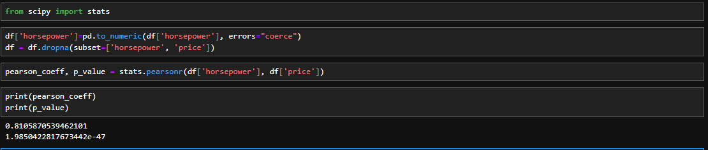

# 🌌 Correlation Statistics

In this chapter we will see how to measure the strength of the correlation between two features.  

Usually, to do this, we use the concept of Pearson Correlation. This method gives us two values:  
- Pearson Correlation Coefficient and
- P-value (Pearson value)

### 1) Pearson Correlation Coefficient:  
This gives the nature of correlation.
- Close to +1: Large Positive relationship
- Close to -1: Large Negative relationship
- Close to 0: No relationship

### 2) P-value:  
This gives the certainty of the correlation.
- P-value <0.001  =>  Strong certainty in the result
- P-value <0.005  =>  Moderate certainty in the result
- P-value <0.1  =>  Weak certainty in the result
- P-value >0.1  =>  No certainty in the result

Combining both the parameters, we can see that there's a strong correlation when the coefficient is close to -1 or 1 and P-value <0.001.  
Eg:  
  
Here, the value is a very very small number and coefficient is close to 1. Thus, a strong positive correlation.  
